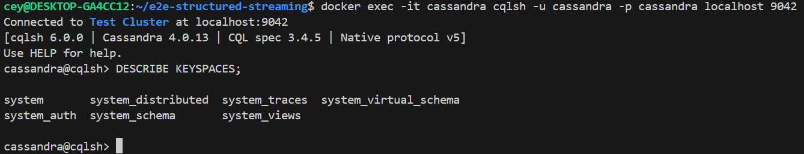
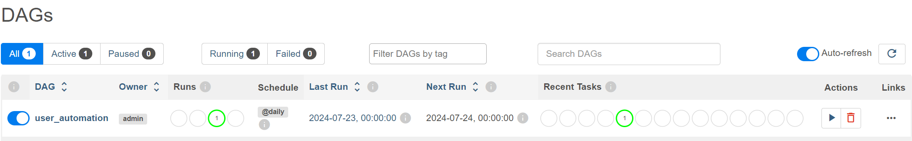
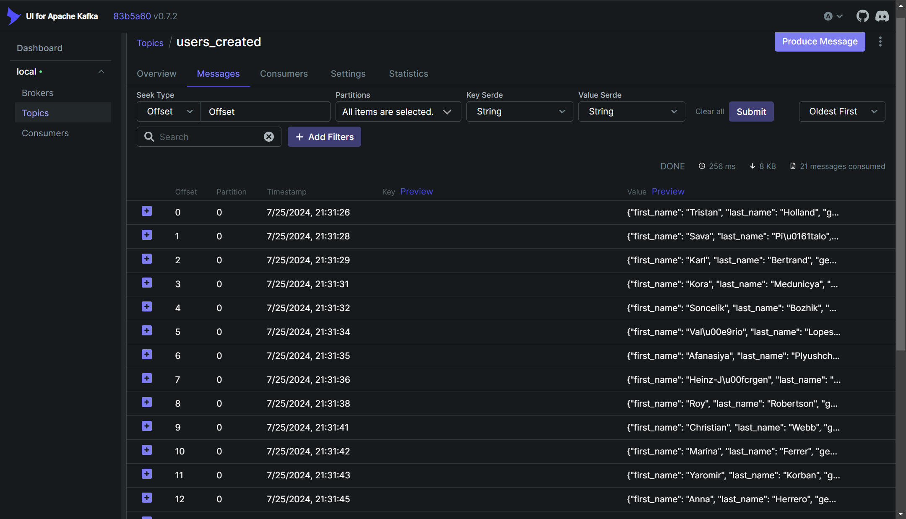
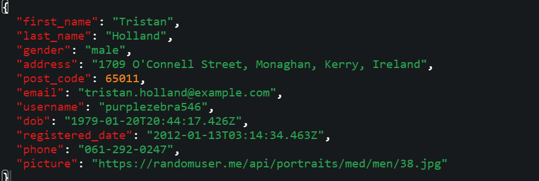
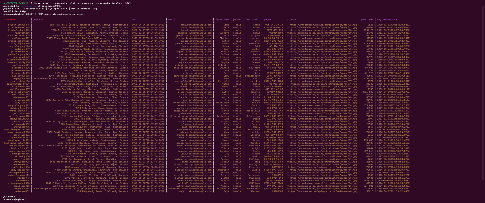
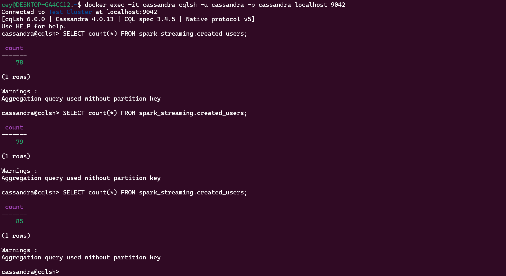

# Data Engineering Pipeline with Spark Structured Streaming

This repository demonstrates the implementation of a data engineering pipeline that utilizes Spark Structured Streaming. The pipeline retrieves random user data from an external API, streams the data to Kafka topics via Apache Airflow, processes the data in real time with Apache Spark, and stores the processed results in Apache Cassandra.

## System Architecture


### Components:

- **Data Source**: The pipeline retrieves random user data from the [randomuser.me](https://randomuser.me) API.
- **Apache Airflow**: Orchestrates and schedules the entire data pipeline.
- **Apache Kafka & Zookeeper**: Kafka acts as the message broker for streaming data, while Zookeeper ensures synchronization of Kafka nodes.
- **Apache Spark**: Consumes data from Kafka topics and performs real-time data processing using Spark Structured Streaming.
- **Apache Cassandra**: A NoSQL database that stores the processed data.
  
### Key Scripts:

- **`kafka_stream.py`**: Airflow DAG script that pushes the API data to Kafka every 1 second for 2 minutes.
- **`spark_stream.py`**: Spark script that consumes and processes the data from Kafka using Spark Structured Streaming.


### Technologies Used:

- **Apache Airflow**
- **Python**
- **Apache Kafka**
- **Apache Zookeeper**
- **Apache Spark**
- **Cassandra**
- **PostgreSQL**
- **Docker**

## Getting Started

### Web UI Links:

- **Airflow UI**: [http://localhost:8080](http://localhost:8080/)
- **Kafka UI**: [http://localhost:8085](http://localhost:8085/)

### Clone the Repository:

```bash
$ git clone https://github.com/JaiBalajiRamkumar/streaming-data-project
```

### Navigate to the Project Directory:

```bash
$ cd streaming-data-project
```

### Create `.env` File for Airflow:

Generate the `.env` file containing the Airflow user ID:

```bash
$ echo -e "AIRFLOW_UID=$(id -u)" > .env
$ echo AIRFLOW_UID=50000 >> .env
```

### Initialize Airflow Services with Docker Compose:

Run the following command to perform database migrations and create the first user account:

```bash
$ docker-compose up airflow-init
```


### Spin Up the Services:

After initialization, start the services with:

```bash
$ docker-compose up -d
```


### Copy Required Files into Spark Container:

Copy the `dependencies.zip` and `spark_stream.py` files into the `spark-master` container:

```bash
$ docker cp dependencies.zip spark-master:/dependencies.zip
$ docker cp spark_stream.py spark-master:/spark_stream.py
```


### Access Cassandra and Check Keyspaces:

Run the following command to access the `cqlsh` shell in the Cassandra container:

```bash
$ docker exec -it cassandra cqlsh -u cassandra -p cassandra localhost 9042
```

Check if there are any existing keyspaces:

```bash
cqlsh> DESCRIBE KEYSPACES;
```



### Unpause the `user_automation` DAG in Airflow UI:

- Access the **Airflow UI** at [http://localhost:8080](http://localhost:8080).
- Login using the credentials: `admin` / `admin`.
- Unpause the `user_automation` DAG to start the data pipeline.



### Monitor Kafka Topics:

Monitor the Kafka topic and message queue using the Kafka UI available at [http://localhost:8085](http://localhost:8085).



### Message Schema:



### Submit Spark Job for Data Processing:

In a new terminal, run the following command to submit the Spark job for processing data from Kafka:

```bash
$ docker exec -it spark-master spark-submit   --packages com.datastax.spark:spark-cassandra-connector_2.12:3.5.1,org.apache.spark:spark-sql-kafka-0-10_2.12:3.5.1   --py-files /dependencies.zip   /spark_stream.py
```

### Verify Data Insertion in Cassandra:

Go back to the `cqlsh` terminal and run the following command to check if data is being inserted into the `created_users` table in Cassandra:

```bash
cqlsh> SELECT * FROM spark_streaming.created_users;
```



### Verify Data Count:

Run the following query multiple times to ensure data is being inserted during the execution of the `user_automation` DAG:

```bash
cqlsh> SELECT count(*) FROM spark_streaming.created_users;
```


